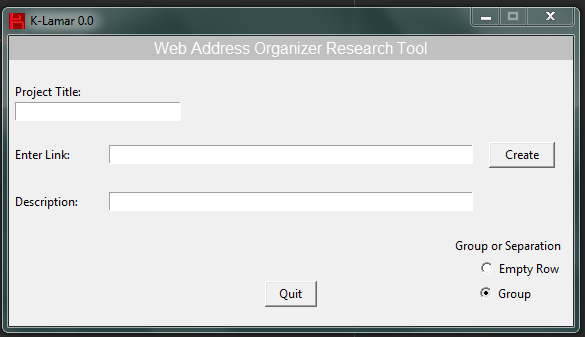

# K-Lamar-0.0
Link as Reference Research Tool
---
 K-Lamar 0.0 it's Tkinter made tool, that helps organize web research, by organizing the relevant web-site addresses used for any project in a fast way. It will help sharing this information with others while explaning the importance of each address in a presentable way. In this first version K-lamar will: 
* Let the user name the file.
* Let any link be copied and pasted into the GUI entry and be submitted.
* Let the user type comments about the link being submitted.
* Produce a CSV file displaying the name of the file, address list, and comments.
* Let the user have spaces between the links for group differentiation in the CSV file.

*Files to download with code*:
---

* Kala.icon (Images file)

* bg1.gif (Images file)

* originalFile (Files file)

---

*Interface*
---

*Collaborators:*
* Mallory Milstead

--

**Bugs:**

Reset button is currently on development.

## License
K-lamar is released under the MIT License 

Copyright 2017, Miguel Lopez

Permission is hereby granted, free of charge, to any person obtaining a copy of this software and associated documentation files (the "Software"), to deal in the Software without restriction, including without limitation the rights to use, copy, modify, merge, publish, distribute, sublicense, and/or sell copies of the Software, and to permit persons to whom the Software is furnished to do so, subject to the following conditions:

The above copyright notice and this permission notice shall be included in all copies or substantial portions of the Software.

THE SOFTWARE IS PROVIDED "AS IS", WITHOUT WARRANTY OF ANY KIND, EXPRESS OR IMPLIED, INCLUDING BUT NOT LIMITED TO THE WARRANTIES OF MERCHANTABILITY, FITNESS FOR A PARTICULAR PURPOSE AND NONINFRINGEMENT. IN NO EVENT SHALL THE AUTHORS OR COPYRIGHT HOLDERS BE LIABLE FOR ANY CLAIM, DAMAGES OR OTHER LIABILITY, WHETHER IN AN ACTION OF CONTRACT, TORT OR OTHERWISE, ARISING FROM, OUT OF OR IN CONNECTION WITH THE SOFTWARE OR THE USE OR OTHER DEALINGS IN THE SOFTWARE.
