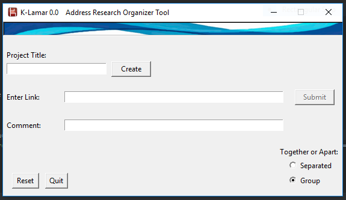

# K-Lamar-0.0
Link as Reference Research Tool
---
 K-Lamar 0.0 it's Tkinter made tool, that helps organize web search research, by organizing the relevant web-site addresses used for any project in a fast way. It will help sharing this information with others while explaning the importance of each address in a presentable way. In this first version K-lamar will: 
* Let the user name the file.
* Let the user paste the link into the GUI entry and submit it.
* Let the user type comments about the link being submitted.
* Let the user have spaces between the links for group differentiation.
* Produce a CSV file displaying the name of the file, address list, and comments.

*Files to download with code*:
---
*Kala.icon (Images file)

*originalFile (Files file)

*Interface*
----

**Bugs:**

Reset button is currently on development.

